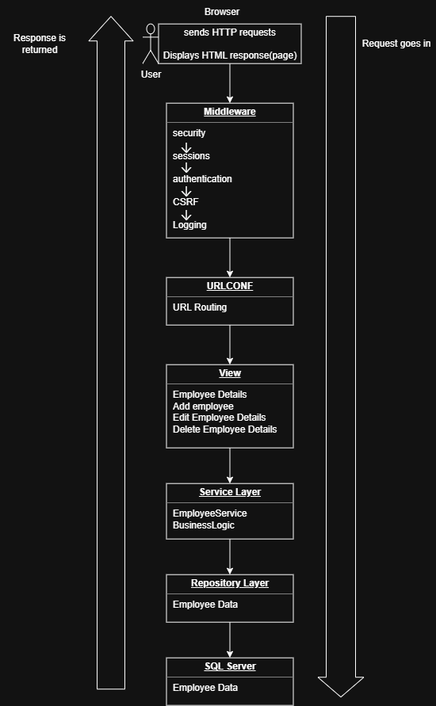

# Employee-Management-System
I have developed a secure employee management system that is a database-driven web application that allows authorised users to efficiently manage employee information. The system provides users with the ability to view, search, add, update and delete employee records while ensuring that employee information is validated and securely managed. The system is also be designed in a way that allows additional functionality like employee skills and training records, to be added at any time the authorised user wishes.

## What the client needs:
The client needs a secure and centralised web application that allows authorised users to efficiently manage, access, search and update employee information while keeping employee records accurate and organised.

## Functional Requirements

| ID | Requirement | Importance |
|---|---|---|
| **FR1** | Allow authorised users to view the list of employees. | High |
| **FR2** | Allow users to search for specific employees. | High |
| **FR3** | Allow users to filter employee information where appropriate. | Medium |
| **FR4** | Allow users to view the details of an individual employee. | High |
| **FR5** | Allow authorised users to add new employee records. | High |
| **FR6** | Allow authorised users to edit existing employee records. | High |
| **FR7** | Allow authorised users to delete employee records. | High |
| **FR8** | Validate employee information before it is stored or updated. | High |
| **FR9** | Require users to be authenticated before accessing restricted employee management functionality. | Critical |

## Non-Functional Requirements

| ID | Requirement | Importance |
|---|---|---|
| **NFR1** | **Security:** Employee information must be protected from unauthorised access, with appropriate authentication, authorisation and security controls. | Critical |
| **NFR2** | **Usability:** The system should have a clear and consistent interface that is easy for authorised users to understand and use. | High |
| **NFR3** | **Performance:** The application should respond efficiently to user requests and manage employee information without unnecessary delays. | High |
| **NFR4** | **Reliability:** The system should handle errors appropriately and provide meaningful feedback when operations succeed or fail. | High |
| **NFR5** | **Maintainability:** The application should use a logical structure and separation of responsibilities so that another developer can understand and maintain the system. | Medium |
| **NFR6** | **Responsiveness:** The user interface should work effectively on different screen sizes and devices. | Medium |
| **NFR7** | **Scalability:** The system should be structured so that additional functionality, such as employee skills and training records, can be added in the future. | Medium |
| **NFR8** | **Data Integrity:** Employee information should be properly validated to help ensure that accurate and appropriate information is stored in the database. | High |

## Main Application Features

The main features of the Employee Management System will include:

| Feature | Description | Importance |
|---|---|---|
| **Employees List** | Allows authorised users to view a list of employees. | High |
| **Employee Search** | Allows users to search for specific employees. | High |
| **Employee Filtering** | Allows users to filter employee information where appropriate. | Medium |
| **Employee Details** | Allows users to view detailed information about an individual employee. | High |
| **Add Employee** | Allows authorised users to add new employee records. | High |
| **Edit Employee** | Allows authorised users to edit existing employee records. | High |
| **Delete Employee** | Allows authorised users to delete employee records. | High |
| **Data Validation** | Validates employee information before it is stored or updated. | High |
| **Authentication & Authorisation** | Restricts employee management functionality to authenticated and authorised users. | Critical |
| **Security** | Protects employee information through appropriate security controls. | Critical |
| **User Feedback** | Provides meaningful feedback when operations succeed or fail. | High |
| **Responsive Design** | Allows the application to work effectively across different screen sizes and devices. | Medium |
| **Future updates** | Allows additional functionality, such as employee skills and training records, to be added in the future. | Medium |

## MVT Architecture Design

