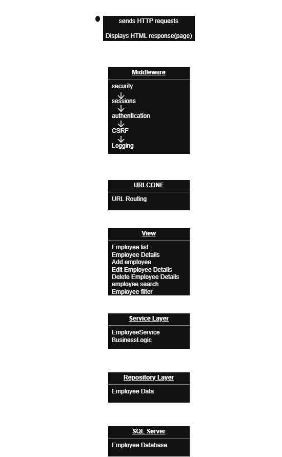
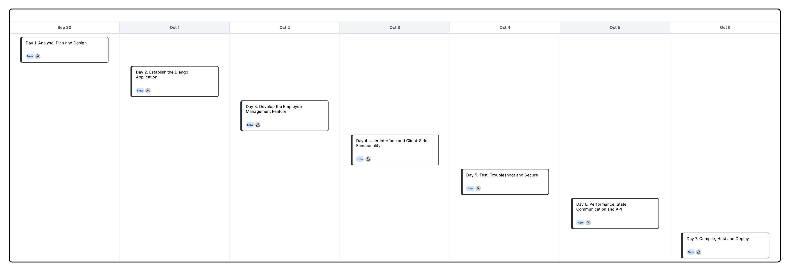
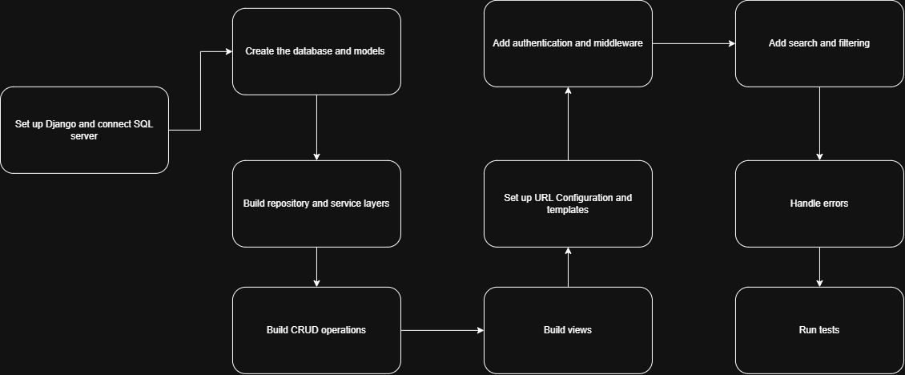

# Employee Management System
The Employee Management System is a secure system that is a database-driven web application that allows authorised users to efficiently manage employee information. The system provides users with the ability to view, search, add, update and delete employee records while ensuring that employee information is validated and securely managed. The system is designed using Django's MVT architecture and uses a SQL Server database to store employee information securely.

## Project objective:
The objective of the SkillBridge Employee Management System is to develop a secure and organised web application that allows authorised users to efficiently manage employee information. The system will provide functionality for viewing, searching, adding, updating and deleting employee records while ensuring that employee information is validated and protected from unauthorised access. The application will also be structured so that additional functionality, such as employee skills and training records, can be added in the future.

## Problem Statement:

The client requires a secure and centralised way to manage employee information effectively without any struggle, that means they need to be able to access, search, add, update, and maintained  employee records without any struggle by authorised personnel, so without an appropriate system the task of managing employee information can become inefficient and extremely difficult to keep records up to date and accurate. The Employee Management System will provide a centralised web-based solution for managing employee information securely and efficiently.

## Functional Requirements

| ID | Requirement | Importance |
|---|---|---|
| **FR1** | Allow authorised users to view the list of employees. | High |
| **FR2** | Allow users to search for specific employees. | High |
| **FR3** | Allow users to filter employee information where appropriate. | Medium |
| **FR4** | Allow users to view the details of an individual employee. | High |
| **FR5** | Allow authorised users to add new employee records. | High |
| **FR6** | Allow authorised users to edit existing employee records. | High |
| **FR7** | Allow authorised users to delete employee records. | High |
| **FR8** | Validate employee information before it is stored or updated. | High |
| **FR9** | Require users to be authenticated before accessing restricted employee management functionality. | Critical |

## Non-Functional Requirements

| ID | Requirement | Importance |
|---|---|---|
| **NFR1** | **Security:** Employee information must be protected from unauthorised access, with appropriate authentication, authorisation and security controls. | Critical |
| **NFR2** | **Usability:** The system should have a clear and consistent interface that is easy for authorised users to understand and use. | High |
| **NFR3** | **Performance:** The application should respond efficiently to user requests and manage employee information without unnecessary delays. | High |
| **NFR4** | **Reliability:** The system should handle errors appropriately and provide meaningful feedback when operations succeed or fail. | High |
| **NFR5** | **Maintainability:** The application should use a logical structure and separation of responsibilities so that another developer can understand and maintain the system. | Medium |
| **NFR6** | **Responsiveness:** The user interface should work effectively on different screen sizes and devices. | Medium |
| **NFR7** | **Scalability:** The system should be structured so that additional functionality, such as employee skills and training records, can be added in the future. | Medium |
| **NFR8** | **Data Integrity:** Employee information should be properly validated to help ensure that accurate and appropriate information is stored in the database. | High |

## Main Application Features

The main features of the Employee Management System will include:

| Feature | Description | Importance |
|---|---|---|
| **Employees List** | Allows authorised users to view a list of employees. | High |
| **Employee Search** | Allows users to search for specific employees. | High |
| **Employee Filtering** | Allows users to filter employee information where appropriate. | Medium |
| **Employee Details** | Allows users to view detailed information about an individual employee. | High |
| **Add Employee** | Allows authorised users to add new employee records. | High |
| **Edit Employee** | Allows authorised users to edit existing employee records. | High |
| **Delete Employee** | Allows authorised users to delete employee records. | High |
| **Data Validation** | Validates employee information before it is stored or updated. | High |
| **Authentication & Authorisation** | Restricts employee management functionality to authenticated and authorised users. | Critical |
| **Security** | Protects employee information through appropriate security controls. | Critical |
| **User Feedback** | Provides meaningful feedback when operations succeed or fail. | High |
| **Responsive Design** | Allows the application to work effectively across different screen sizes and devices. | Medium |
| **Future updates** | Allows additional functionality, such as employee skills and training records, to be added in the future. | Medium |

## Proposed Data Model

| Field | Type | Description |
|---|---|---|
| `employee_id` | Text (13), must be unique | Employee identification number |
| `first_name` | Text (max 20) | Employee first name |
| `last_name` | Text (max 20) | Employee last name |
| `email` | Text, must be unique | The employee's email address |
| `department` | Text (max 20) | The employee's department |
| `date_joined` | Date | The date the employee joined the job |
| `phone` | Text (max 15), optional | The employee's phone number |
| `title` | Text (max 50) | The employee's job title |
| `employee_type` | Text, chosen from fixed list | The type of role the employee plays, such as full-time or intern |
| `salary` | Decimal (10, 2) | The employee's salary |
| `status` | Boolean (active/not active) | Whether or not the employee is active |

## MVT Architecture Design

## Data Storage Approach

The system is going to use SQL Server for its database, and the data will be stored in tables made of rows and columns. The main tables will be the Employee and Department tables, where each employee row will have a `department_id` column that points to a row in the Department table, making it a foreign key. The tables will be created from Django models using migrations so that the database structure is built from the code instead of manually.

The data that will be stored is Employee records such as name, email, department and date joined, departments and user accounts for when they log in using Django's built-in `auth_user`. Django communicates with the database through the Django ORM, where developers can use Python code such as `Employee.objects.all()` and the ORM converts it into SQL for the database.

The application accesses the data through the following structure:

**View → Service Layer → Repository Layer → Model/ORM → SQL Server**
## State Management Approach

For the user, the system needs to remember that they are logged in, who they are, the permissions they have in the system and short messages that will appear if the authorised user makes a change, such as adding a new employee.

The application log will record logins, logouts and failed login attempts. It will also record important changes, such as who added or deleted an employee. The application will remember login times and when a user's session ends.

## Development Tasks

The system will be built by developing:

1. Django and SQL Server connection
2. The database and models
3. The repository and service layers
4. CRUD operations for employee records
5. The views
6. The URL configuration and templates
7. Authentication and middleware
8. Search and filtering
9. Error handling
10. Testing

## Testing Approach

The application will be tested at different levels. Unit testing will test individual functions such as employee validation and CRUD operations. Integration testing will test that the different application layers work together correctly, including the Service, Repository, Django ORM and SQL Server database. System testing will test the complete Employee Management System and its main functionality, including viewing, searching, filtering, adding, editing and deleting employees. The functional and non-functional requirements will then be checked manually to confirm that the completed system works as expected.

## Security Considerations

Users must log in before they can access employee information, and permissions for actions such as adding, editing and deleting will only be given to authorised users. Django's CSRF protection will be enabled, passwords will be securely hashed using Django's built-in authentication system, and the ORM will be used to help protect against SQL injection. Sessions will expire after a set time, and the secret key and database password will be stored in environment variables instead of in the code.

## Deployment Approach

The application will start by running locally using SQL Server. When deployed, debug mode will be turned off, the allowed hosts will be set to the live domain, static files will be collected, and the migrations will then be run on the live database.

## Estimated Timeline

| Day | Activity |
|---|---|
| Day 1 | Analyse, Plan and Design |
| Day 2 | Establish the Django Application |
| Day 3 | Develop the Employee Management Feature |
| Day 4 | User Interface and Client-Side Functionality |
| Day 5 | Test, Troubleshoot and Secure |
| Day 6 | Performance, State, Communication and API |
| Day 7 | Compile, Host and Deploy |

## Development Sequence

The development sequence as seen above will follow the planned order of analysing and designing the system, establishing the Django application and database, developing the Employee Management feature, implementing the user interface and client-side functionality, testing and securing the application, implementing performance, state management, communication and API functionality, and finally compiling, hosting and deploying the application.
